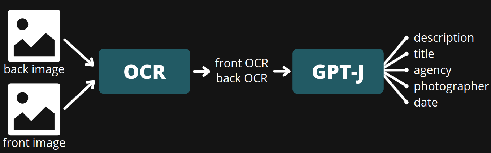

# Table of Contents
- [Table of Contents](#table-of-contents)
- [Fine-tune GPTJ for text generation](#fine-tune-gptj-for-text-generation)
- [Requirements](#requirements)
- [Model](#model)
- [Training Model](#training-model)
- [Inference](#inference)
- [Demo](#demo)

# Fine-tune GPTJ for text generation
Definition of problem: A product has 2 images called "front" and "back". The problem is how to extract the following information from the images: *description*, *title*, *agency*, *photographer* and *date*. And I will fine-tune the GPTJ model to extract these information. So that's why I call it "Multi-tasking GPTJ".

# Requirements
- [DeepSpeed](https://github.com/microsoft/DeepSpeed)

    ```bash
    git clone https://github.com/microsoft/DeepSpeed
    cd DeepSpeed
    DS_BUILD_OPS=1 pip install .
    ds_report
    ```
- [transformers](https://huggingface.co/docs/transformers/index)
    
    ```bash
    pip install transformers
    ```

# Model

<p align="center">

</p>

```
Input: Front OCR + Back OCR
Output: description, title, agency, photographer, date
```

Example:

```
Input:
    - Front OCR: ME | 1994: ::: | RES | ALL CALL AND MUSEUM
    - Back OCR: WILLIAM DOIG (NUJ 03: | 62 NETHERPARK AVENU | GLASGOW G44 3XW | SCOTLAND | 041-637-2005 | DEPENDENT | LAURY | Glasgow | Museum and Art Galleries, Kelvingrove
    -> Input for GPTJ: <language> en <back> WILLIAM DOIG (NUJ 03: <b> 62 NETHERPARK AVENU <b> GLASGOW G44 3XW <b> SCOTLAND <b> 041-637-2005 <b> DEPENDENT <b> LAURY <b> Glasgow <b> Museum and Art Galleries, Kelvingrove <front> ME <b> 1994: ::: <b> RES <b> ALL CALL AND MUSEUM <END>

Output:
    - description: 1994 - WILLIAM DOIG (NUJ 03: Scotland, Glasgow. Museum and Art Galleries, Kelvingrove.
    - title: WILLIAM DOIG
    - agency: ""
    - photographer: ""
    - date: 1994
    -> Output from model: <language> en <rewrite> 1994 - WILLIAM DOIG (NUJ 03: Scotland, Glasgow. Museum and Art Galleries, Kelvingrove. <title> WILLIAM DOIG <date> 1994
```

# Training Model
For training the model, I use the following command:

```bash
deepspeed --num_gpus=1 run_clm.py \
    --deepspeed ds_config_gptj.json \
    --model_name_or_path EleutherAI/gpt-j-6B \
    --train_file data/train.csv \
    --validation_file data/val.csv \
    --do_train \
    --do_eval \
    --fp16 \
    --overwrite_cache \
    --evaluation_strategy=steps \
    --output_dir finetune_gptj6b \
    --num_train_epochs 40  \
    --eval_steps 10 \
    --gradient_accumulation_steps 32 \
    --per_device_train_batch_size 2 \
    --use_fast_tokenizer False \
    --learning_rate 5e-06 \
    --warmup_steps 10 \
    --save_total_limit 20 \
    --save_steps 500 \
    --save_strategy steps \
    --tokenizer_name EleutherAI/gpt-j-6B
```

# Inference
For inferecce, you can refer to the `inference.py` file.

```python
prompt = "<language> en <back> WILLIAM DOIG (NUJ 03: <b> 62 NETHERPARK AVENU <b> GLASGOW G44 3XW <b> SCOTLAND <b> 041-637-2005 <b> DEPENDENT <b> LAURY <b> Glasgow <b> Museum and Art Galleries, Kelvingrove <front> ME <b> 1994: ::: <b> RES <b> ALL CALL AND MUSEUM <END>"
texts = [tokenizer.special_tokens_map["bos_token"] + " " + prompt]
encoding = tokenizer(texts, padding=False, return_tensors='pt').to(device)
generated_ids = model.generate(
    **encoding, 
    do_sample=True,
    max_length=max_length,
    temperature=temperature,
    num_return_sequences=num_return_sequences,
    pad_token_id=tokenizer.eos_token_id
)
generated_texts = tokenizer.batch_decode(generated_ids, skip_special_tokens=True)
```

# Demo
This is a [video](https://www.youtube.com/watch?v=p7LbADDKVE4) demo of the model